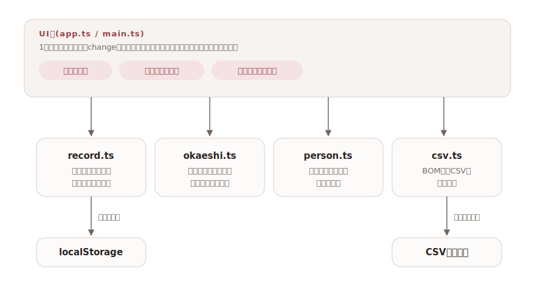

# okurimono

[](https://github.com/miruky/okurimono/actions/workflows/ci.yml)
[](https://github.com/miruky/okurimono/actions/workflows/deploy.yml)

[](LICENSE)

**冠婚葬祭・贈答の記録帳。やりとりの履歴を相手ごとにたどり、お返しの未対応と金額の目安が分かるアプリ。**

公開ページ: https://miruky.github.io/okurimono/

## 概要

okurimonoはご祝儀・香典・お中元のような贈答のやりとりを記録する台帳である。「あげた」「もらった」を日付・種別・相手・金額とともに残すと、お返しがまだの記録が一覧になり、半返しの相場(いただいた額の3分の1〜2分の1)から金額の目安が出る。相手ごとの集計では、その人と過去にいくら贈り合ってきたかが件数と合計金額で分かるので、次に包む額を決めるときの拠り所になる。台帳の上部にはいただいた額・おくった額・件数・お返し待ちのまとめと種別の内訳が並ぶ。

台帳はCSVで表計算へ持ち出せるほか、JSONでバックアップを取って別の端末へ引き継げる。表示は端末の設定に追従しつつ、明るい・暗いを手動で固定することもできる。データはブラウザのlocalStorageに保存され、サーバーには何も送らない。

### なぜ作ったのか

贈答の記録は「いざ必要になったとき手元にない」ものの代表で、結婚式の前に「あの家からいくらいただいたか」を家族の記憶と古い祝儀袋から掘り起こすことになりがちだった。家計簿には混ぜづらく、表計算では「お返しがまだか」「相手ごとの累計」を毎回数式で組む必要がある。贈答に必要な見方だけを最初から備えた専用の台帳にした。

## アーキテクチャ



UI層はフレームワークなしのTypeScriptで書く。見出し・図版・操作部の骨格は最初に一度だけ描き、以降はまとめの数値・お返し待ち・相手別集計・記録一覧という変わる領域だけを差し替える。各入力は記録のIDで対応づけてあるので、再描画や並べ替えでも入力途中の値とフォーカスが保たれる。お返しの抽出と目安計算、相手ごとの集計、台帳全体の統計、CSV生成、バックアップの取り込み、テーマの判定はいずれもDOMに依存しない純粋なモジュールで、そのまま単体テストできる。入場やカウントアップの演出はGSAPで付け、`prefers-reduced-motion` を尊重して止められる。

## 技術スタック

| カテゴリ             | 技術                           |
| :------------------- | :----------------------------- |
| 言語                 | TypeScript 5(strict)           |
| ビルド               | Vite 8                         |
| テスト               | Vitest 4                       |
| アニメーション       | GSAP(ScrollTrigger)            |
| リンタ・フォーマッタ | ESLint 9 / Prettier            |
| CI / 配信            | GitHub Actions / GitHub Pages  |
| 永続化               | localStorage(外部サービスなし) |

## 使い方

### 記録とお返しの管理

記録は日付・区分(あげた・もらった)・種別・相手・品物・金額で残す。もらった記録は追加時に自動で「お返し待ち」になり、お返しを済ませたら行の状態を「お返し済み」に変える。お中元・お歳暮・お年賀はお返しを前提としない慣習に合わせ、最初から「お返し不要」で登録される。

### お返しの目安

お返し待ちの記録には、いただいた額からの目安が表示される。

| いただいた額 | 目安(3分の1〜半返し) |
| :----------- | :------------------- |
| 30,000円     | 10,000円〜15,000円   |
| 10,000円     | 3,300円〜5,000円     |
| 5,000円      | 1,700円〜2,500円     |

目安は100円単位に丸めた機械的な計算で、地域や間柄による相場の違いまでは考慮しない。

### 相手ごとの集計とまとめ

相手の名前ごとに、やりとりの件数・あげた合計・もらった合計・最後のやりとりの日を一覧する。名前を押すとその相手の記録だけに絞り込める。集計は名前の完全一致で行うため、「佐藤」と「佐藤(伯母)」は別の相手になる。呼び方を最初に決めて揃えておくとよい。画面上部のまとめには台帳全体のいただいた額・おくった額・記録の数・お返し待ち件数と、種別ごとの件数の内訳が出る。

### 記録の検索・絞り込み・並べ替え

記録は相手名・品物名で検索でき、区分(あげた・もらった)で絞り込める。並べ替えは日付の新しい順・古い順・金額の高い順・相手の名前順から選べる。各記録には覚え書きのメモ欄があり、お返しの内容や間柄、出席の有無などを残せる。

### 書き出しとバックアップ

「CSVを保存」で台帳全体をCSVファイルにする。Excelで文字化けしないようBOM付きUTF-8で出力し、カンマや改行を含むメモも列がずれないよう引用符で包む。「バックアップ(JSON)」は記録を丸ごとJSONに書き出し、「取り込み」で別の端末や作り直した環境へ復元する。取り込みはIDが一致する記録を二重に増やさず、新しいものだけを足す。

### 表示テーマ

右上のトグルで、端末の設定に合わせる(自動)・明るい・暗いを切り替える。選択は保存され、次回も引き継がれる。明示指定したときは描画前にテーマを確定するため、再読み込みでも明暗がちらつかない。

### 制約

- 通知は送らない。お返し待ちは画面を開いたときに見える形で示すだけにしている。
- 金額の分からない品物は0円として扱い、目安や集計の金額には含まれない。
- データは端末のブラウザに保存される。端末をまたぐときはJSONのバックアップを書き出して取り込む手動の引き継ぎになり、自動同期はしない。

## プロジェクト構成

- `index.html` — エントリポイント。テーマ確定の先頭スクリプトを含む
- `src/main.ts` — 起動。ストア初期化・初回の見本データ投入・テーマ適用
- `src/app.ts` — 台帳画面の組み立てとイベント処理
- `src/motion.ts` — GSAPによる入場演出・カウントアップ・水引の装飾罫線
- `src/icons.ts` — 線画SVGアイコン
- `src/style.css` — デザイントークンとスタイル(ライト・ダーク対応)
- `src/lib/record.ts` — 記録の型・検証・並べ替え・永続化
- `src/lib/okaeshi.ts` — お返し待ちの抽出と目安の計算
- `src/lib/person.ts` — 相手ごとの集計
- `src/lib/stats.ts` — 台帳全体の集計(金額・件数・種別の内訳)
- `src/lib/csv.ts` — CSV書き出し
- `src/lib/backup.ts` — JSONバックアップの取り込み(ID重複の排除)
- `src/lib/theme.ts` — 表示テーマの判定と保存
- `src/lib/seed.ts` — 初回起動時の見本データ
- `docs/architecture.svg` — 構成図
- `.github/workflows/` — CI(lint・テスト・ビルド)とPagesデプロイ

## はじめ方

### 前提条件

- Node.js 22以上

### セットアップ

```bash
git clone https://github.com/miruky/okurimono.git
cd okurimono
npm install
npm run dev
```

### テストの実行

```bash
npm test
```

### Lintの実行

```bash
npm run lint
```

### ビルド

```bash
npm run build
```

GitHub Pagesではリポジトリ名のサブパスで配信されるため、デプロイ時は環境変数 `OKURIMONO_BASE=/okurimono/` でViteの `base` を切り替える(`.github/workflows/deploy.yml` 参照)。

## 設計方針

- **「次にいくら包むか」を中心に据える** — 単なる出納の記録ではなく、お返し待ちの一覧と相手ごとの累計という、贈答で実際に迷う2つの場面に直接答える画面構成にした。
- **慣習を既定値に織り込む** — もらったら「お返し待ち」、季節の贈答は「お返し不要」という世間の運用をそのまま既定値にし、入力の手数を減らす。例外は行の状態を変えるだけで上書きできる。
- **目安は機械的に、判断は人に** — 半返しの計算はあくまで相場の機械的な適用に留め、丸めも100円単位の単純な規則にした。最終判断に必要な過去の履歴を添えて見せる。
- **入力は寛容に、保存は厳密に** — 保存データの復元は型ガードで検証し、壊れた要素だけを読み飛ばす。CSVはBOMと引用符処理で表計算側の事故を防ぐ。取り込みも同じ型ガードを通し、IDの重複は増やさない。
- **帳面の見立てで作る** — 箱と影で要素を囲わず、罫線と余白で項目を分ける編集的なレイアウトにした。見出しは明朝、和紙のような地色に小豆色を一点だけ差し、水引の結びをロゴと罫線の意匠にした。動きは入場とカウントアップ程度に抑え、`prefers-reduced-motion` で止められる。

## ライセンス

[MIT](LICENSE)
